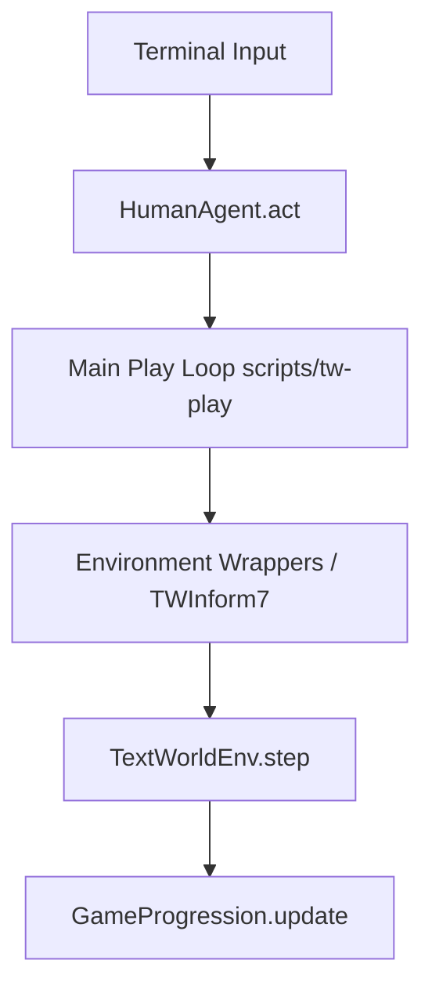

# Analysis and Algorithm for Mapping TW Commands to Bash Commands

This document contains the function chain analysis and the step-by-step algorithm to replace TextWorld (TW) commands with Bash commands in the game interpreter loop.

---

## 1. Function Chain Analysis

When a user interacts with the TextWorld terminal, input and execution flow through the following chain:



### Detailed Trace:
1. **Input Generation**:
   In the main loop of `scripts/tw-play` (or `textworld.play` in [helpers.py](file:///C:/Users/User/Yoga/TextWorld4Bash/textworld/helpers.py)), the agent is polled for the next command:
   ```python
   command = agent.act(game_state, reward, done)
   ```
2. **Command Capture**:
   In [human.py](file:///C:/Users/User/Yoga/TextWorld4Bash/textworld/agents/human.py), the `HumanAgent.act` method reads input using `prompt(...)` (if `prompt_toolkit` is available, utilizing `game_state["admissible_commands"]` for autocompletion) or standard `input('> ')`.
3. **Command Propagation**:
   The returned command is passed to the environment wrapper chain:
   ```python
   game_state, reward, done = env.step(command)
   ```
4. **Wrapper Execution**:
   If wrappers like `TWInform7` (in [tw_inform7.py](file:///C:/Users/User/Yoga/TextWorld4Bash/textworld/envs/wrappers/tw_inform7.py)) are active, they intercept `step(command)`, process debug logs/extra info, and delegate to the underlying environment.
5. **Interpreter Core Execution**:
   In `TextWorldEnv.step` (defined in [tw.py](file:///C:/Users/User/Yoga/TextWorld4Bash/textworld/envs/tw.py)):
   - The command is stripped: `command = command.strip()`
   - Looked up in valid commands: `idx = self._prev_state["_valid_commands"].index(command)`
   - The game progression is updated with the corresponding action: `self._game_progression.update(action)`
   - The next game state is compiled by `_gather_infos()`.

---

## 2. Step-by-Step Mapping Algorithm

To swap TW commands with Bash commands, we introduce a **bi-directional translation** mechanism using [tw_bash_command_mapping.json](file:///C:/Users/User/Yoga/TextWorld4Bash/Research/prompts/tw_bash_command_mapping.json).

### Step 1: Load and Build Translation Maps
Parse the JSON mapping file to create two lookup dictionaries:
*   **Bash-to-TW Dictionary**: Maps Bash inputs to standard TW actions.
    ```python
    bash_to_tw = {"ls": "look", "cd north": "go north", "mv ~": "take", ...}
    ```
*   **TW-to-Bash Dictionary**: Maps TW actions to Bash representations.
    ```python
    tw_to_bash = {"look": "ls", "go north": "cd north", "take": "mv ~", ...}
    ```

### Integrating New Mappings

Adding a new mapping like `{"tw": "take", "bash": "mv ~"}` is seamless. The `BashCommandMappingWrapper` automatically loads new entries from the `tw_bash_command_mapping.json` file during its initialization. These entries then populate the `self.bash_to_tw` and `self.tw_to_bash` dictionaries, enabling bidirectional translation for the new command pair within the existing algorithm.

### Step 2: Translate Input Commands (Bash -> TW)
Before sending the command to the underlying environment:
1. Intercept the user input command string (which is now in Bash format).
2. Look up the command in `bash_to_tw`.
3. If a match is found, replace the command with the corresponding TW command.
4. If not found, pass the command through unchanged (allowing generic or untranslated actions).

### Step 3: Translate Environment Output State (TW -> Bash)
The environment's `game_state` contains TW-specific text elements. To maintain the Bash interface, translate these outputs:
1. **Admissible Commands**: Translate the autocomplete/options list (`game_state["admissible_commands"]`):
   * For each command `cmd`, if it exists in `tw_to_bash`, replace it with its Bash counterpart.
2. **Policy Commands**: Translate the oracle suggestions (`game_state["policy_commands"]`) using `tw_to_bash`.
3. **Last Command**: Translate `game_state["last_command"]` back to the Bash equivalent so renderers display the Bash command typed by the user.

---

## 3. Recommended Implementation (Wrapper Approach)

The cleanest way to implement this algorithm without modifying the core TextWorld engine or agent classes is via an **Environment Wrapper**:

```python
import json
from typing import Tuple
from textworld.core import Wrapper, GameState

class BashCommandMappingWrapper(Wrapper):
    def __init__(self, env, mapping_path: str):
        super().__init__(env)
        self.bash_to_tw = {}
        self.tw_to_bash = {}
        self._load_mappings(mapping_path)

    def _load_mappings(self, mapping_path: str):
        with open(mapping_path, 'r', encoding='utf-8') as f:
            data = json.load(f)
        for item in data.get("commands", []):
            tw_cmd = item["tw"]
            bash_cmd = item["bash"]
            self.bash_to_tw[bash_cmd] = tw_cmd
            self.tw_to_bash[tw_cmd] = bash_cmd

    def _translate_state(self, state: GameState) -> GameState:
        # Translate admissible commands
        if "admissible_commands" in state and state["admissible_commands"]:
            state["admissible_commands"] = [
                self.tw_to_bash.get(cmd, cmd) for cmd in state["admissible_commands"]
            ]
        # Translate policy / oracle commands
        if "policy_commands" in state and state["policy_commands"]:
            state["policy_commands"] = [
                self.tw_to_bash.get(cmd, cmd) for cmd in state["policy_commands"]
            ]
        # Translate the last run command
        if "last_command" in state and state["last_command"]:
            state["last_command"] = self.tw_to_bash.get(state["last_command"], state["last_command"])
        return state

    def step(self, command: str) -> Tuple[GameState, float, bool]:
        # Step 2: Translate input from Bash to TW
        tw_command = self.bash_to_tw.get(command.strip(), command)
        
        # Call underlying environment step
        state, reward, done = self._wrapped_env.step(tw_command)
        
        # Step 3: Translate output state from TW to Bash
        state = self._translate_state(state)
        return state, reward, done

    def reset(self) -> GameState:
        state = self._wrapped_env.reset()
        return self._translate_state(state)
```

To integrate this wrapper:
* Add it to the list of wrappers in [helpers.py:start](file:///C:/Users/User/Yoga/TextWorld4Bash/textworld/helpers.py#L19-L53) or wrap the environment after creation.

---

## 4. Actual Implementation Details

The proposed algorithm has been fully implemented and integrated into the repository as follows:

### 4.1. Wrapper Class
* **Location**: [bash_mapping.py](file:///C:/Users/User/Yoga/TextWorld4Bash/textworld/envs/wrappers/bash_mapping.py)
* **Class**: `BashCommandMappingWrapper`
* **Exposed in**: [__init__.py](file:///C:/Users/User/Yoga/TextWorld4Bash/textworld/envs/wrappers/__init__.py) under `textworld.envs.wrappers`.

### 4.2. Environment Hook
* **File**: [helpers.py](file:///C:/Users/User/Yoga/TextWorld4Bash/textworld/helpers.py)
* **Changes**:
  * Added a `bash_mapping: bool` parameter to `start()` (defaults to `False` to maintain compatibility with existing test suites).
  * Added a `bash_mapping: bool` parameter to `play()` (defaults to `True` for interactive sessions).
  * If `bash_mapping` is enabled, the environment is automatically wrapped with `BashCommandMappingWrapper(env)`.

### 4.3. CLI Utility Support
* **File**: [tw-play](file:///C:/Users/User/Yoga/TextWorld4Bash/scripts/tw-play)
* **Changes**:
  * Added `--no-bash` option (using `action="store_false"` and `dest="bash_mapping"`).
  * Enabled `bash_mapping` by default when invoking the play loop so players automatically get the Bash interface.

### 4.4. Verification & Testing
* **File**: [test_bash_mapping.py](file:///C:/Users/User/Yoga/TextWorld4Bash/tests/test_bash_mapping.py)
* **Details**: Contains test cases implementing a `DummyEnvironment` simulating a live game. Validates:
  * Proper load and lookup mapping dictionaries.
  * Translation of terminal inputs (e.g., `ls` -> `look`).
  * Translation of outputs (`admissible_commands`, `policy_commands`, and `last_command`).
  * Seamless pass-through of unmapped commands.

# 5 Особливості запуску

**Принцип сортування правил мапінгу:** Правила мапінгу в `tw_bash_command_mapping.json` перевіряються зверху вниз. Щоб уникнути некоректних збігів, найбільш конкретні правила (наприклад, `mv {} ~`, які містять літеральні символи або є менш загальними) повинні розміщуватися перед більш загальними правилами (наприклад, `mv {1} {2}`, які можуть збігатися з ширшим діапазоном команд).

1. Згенеруйте тестову гру:
    export PYTHONPATH="."
    python scripts/tw-make custom --world-size 2 --nb-objects 3 --quest-length 2 --output test_game.z8
  (Примітка: Ім'я файлу повинно закінчуватися на .z8, щоб компілятор Inform7 зміг його успішно зібрати).
2. Запустіть гру з підтримкою Bash-команд (за замовчуванням):
    python scripts/tw-play test_game.z8
  Переконайтеся, що автодоповнення пропонує Bash-команди (наприклад, ls, cd north), а введення ls та cd north викликає виконання look та go north відповідно.
3. Запустіть гру зі стандартними командами TextWorld:
    python scripts/tw-play test_game.z8 --no-bash
  Переконайтеся, що гра та автодоповнення повернулися до стандартних команд TextWorld (look, go north тощо).

